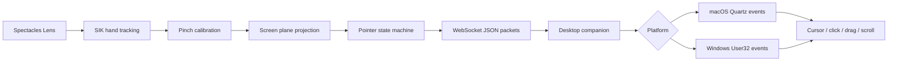

# AirTouch

AirTouch turns a laptop screen into a spatial touch surface using Snap Spectacles hand tracking.

The Lens calibrates the physical display from four pinched corners, projects the tracked index fingertip onto that plane, streams normalized pointer packets over WebSocket, and a desktop companion converts those packets into OS mouse events.

This is not a hardware touchscreen. It is a spatial input layer for quick prototyping.

## Status

MVP implemented:

- Spectacles hand tracking through Spectacles Interaction Kit
- Four-corner pinch calibration
- 3D fingertip projection to normalized UV coordinates
- smoothing and deadzone
- plane-touch mode for no-pinch click and drag
- MeshBuilder calibration plane visual
- optional manual corner handles and confirm-gated streaming
- WebSocket streaming
- macOS cursor movement, click, drag, and scroll
- Windows cursor movement, click, drag, and scroll
- Lens Studio editor simulator
- desktop fake-hand simulator
- recalibration command

Not implemented yet:

- multi-touch
- pinch zoom gestures
- active fingertip marker rendering
- persistent anchors
- automatic screen detection
- polished in-Lens UI

## Architecture



## Repository Layout

```txt
AirTouch/
├── Assets/Scripts/AirTouch/       Lens Studio TypeScript
├── Assets/Prefabs/                Optional Lens-side helper prefabs
├── mac-companion/                 Cross-platform desktop companion
├── docs/                          Architecture, protocol, setup, testing
├── tsconfig.airtouch.json         Focused TypeScript check for AirTouch scripts
├── LICENSE.md
└── README.md
```

The companion folder is still named `mac-companion` for continuity, but it now supports macOS and Windows.

## Quick Start

### 1. Start The Desktop Companion

macOS or Windows:

```bash
cd mac-companion
python3 server.py --dry-run
```

Windows may use `py` instead of `python3`:

```powershell
cd mac-companion
py server.py --dry-run
```

Dry-run prints events without moving the cursor.

### 2. Configure The Lens

Open `AirTouch.esproj` in Lens Studio.

Attach `Assets/Scripts/AirTouch/AirTouchController.ts` to a scene object.

Enable Lens Studio Experimental API mode before testing WebSocket networking. AirTouch uses `InternetModule`, and Lens Studio/Spectacles can block `ws://` connections when Experimental APIs are disabled.

Set `websocketUrl`:

```txt
ws://YOUR_DESKTOP_IP:8765
```

Example:

```txt
ws://192.168.0.179:8765
```

Do not use `127.0.0.1` on Spectacles. On device, that points to Spectacles, not your desktop.

### 3. Run On Spectacles

Make sure Spectacles and the desktop are on the same network.

Start the Lens. The companion terminal should print:

```txt
client connected: ...
```

### 4. Calibrate

Pinch the screen corners in order:

```txt
Top Left -> Top Right -> Bottom Left -> Bottom Right
```

After calibration:

```txt
hover -> cursor move
touch calibrated screen plane -> mouse down
hold touch + move -> drag
lift away from plane -> mouse up
pinch still works as an optional click/drag fallback
index + middle fingertips move together -> scroll
optional legacy scroll mode -> pinch hold + move in the hover band scrolls
```

Optional confirm gate workflow:

```txt
after calibration, corner handles + plane visual appear
move corner handles manually to fine-tune the mapped screen plane
confirm button appears above the plane
pinch on the confirm button to enable pointer packet streaming
confirm button hides after successful confirm
```

Confirm button integration:

```txt
AirTouchController does not auto-create the confirm button
it looks for an existing SceneObject named ConfirmButton
the controller only toggles ConfirmButton visibility
wire your button callback to AirTouchController api.confirmAirTouch
```

Fingertip visual inputs are present for future authored feedback, but active fingertip marker rendering is currently disabled.

Manual corner handles and confirm-gate behavior are enabled in the controller by default, with optional callback support on confirm.

The calibrated plane visual is generated with Lens Studio `MeshBuilder` and can use `calibrationPlaneMaterial` for consistent visibility.

### 5. Move The Real Cursor

Stop dry-run with `Ctrl-C`, then run:

macOS:

```bash
python3 server.py
```

Windows:

```powershell
py server.py
```

## Lens Studio Editor Simulator

`enableEditorSimulator` is on by default.

In the Lens Studio editor preview:

```txt
press -> mouse down
drag -> mouse dragged
release -> mouse up
```

Use `ws://127.0.0.1:8765` when testing from the editor on the same desktop as the companion.

## Fake Hand Desktop Test

To test the desktop companion without Lens Studio or Spectacles:

```bash
python3 server.py --fake-hand
```

Preview the same path without moving the cursor:

```bash
python3 server.py --dry-run --fake-hand
```

The fake-hand path includes hover, click, drag, and scroll packets.

## Platform Notes

macOS:

- Real cursor injection uses Quartz through PyObjC.
- If events are ignored, grant Accessibility permission to Terminal, Python, or your IDE.
- Install optional dependency if needed:

```bash
python3 -m pip install --user -r mac-companion/requirements-macos.txt
```

Windows:

- Real cursor injection uses `ctypes` + User32, so no Python package is required.
- If events are ignored, try running the terminal normally first, then as Administrator if needed.
- Allow Python through Windows Firewall for inbound WebSocket connections.

## Network Troubleshooting

If `ws://DESKTOP_IP:8765` fails from Spectacles:

- confirm Lens Studio Experimental API mode is enabled
- confirm the port is included
- confirm both devices are on the same Wi-Fi
- confirm firewall allows incoming connections on port `8765`
- confirm the companion terminal shows `AirTouch desktop companion listening`

The Lens auto-normalizes local URLs like `ws://192.168.0.179` to `ws://192.168.0.179:8765`, but it is still better to type the port explicitly.

## Documentation

- [Architecture](docs/architecture.md)
- [Desktop Setup](docs/desktop-setup.md)
- [Lens Setup](docs/lens-setup.md)
- [Protocol](docs/protocol.md)
- [Testing Checklist](docs/testing-checklist.md)
- [Concept Note](docs/concept-note.md)
- [Development](docs/development.md)
- [Contributing](CONTRIBUTING.md)

## Development

Run checks:

```bash
tsc --project tsconfig.airtouch.json
PYTHONPYCACHEPREFIX=/tmp/airtouch_pycache python3 -m py_compile mac-companion/server.py mac-companion/mouse_controller.py mac-companion/fake_client.py
```

## License

This project is released under the terms in [LICENSE.md](LICENSE.md). Lens Studio, Spectacles, Spectacles Interaction Kit, and related Snap/Specs developer tools remain subject to their own terms.
