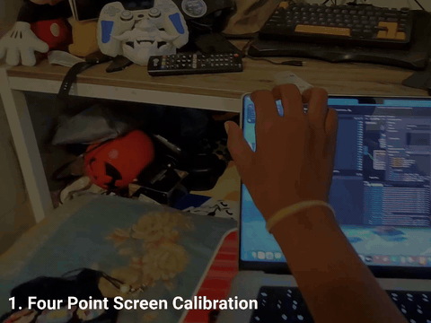
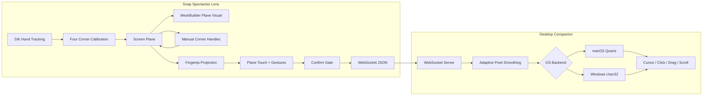

# AirTouch

**Turn the screen you already own into the touchscreen you wish it had.**

AirTouch is a Snap Spectacles prototype that makes a regular laptop display behave like a spatial touchscreen. The Lens tracks your fingertips, calibrates the physical display as a 3D plane, projects hand movement into screen coordinates, and streams pointer packets to a small macOS/Windows desktop companion that injects cursor events.

No touchscreen overlay. No hardware mod. Just a calibrated screen plane, hand tracking, and a little bit of audacity.

> **Spectacular Prototypes #11**  
> A spatial touch layer for laptops, built with Snap Spectacles.

## Demo

Watch the prototype in action:

[](https://drive.google.com/file/d/1ugl3otYg8ZDUduHIWbYB7V2vIUHvcVgG/view?usp=sharing)

[Watch the full AirTouch demo video](https://drive.google.com/file/d/1ugl3otYg8ZDUduHIWbYB7V2vIUHvcVgG/view?usp=sharing)

## Review And No-Hardware Demo

AirTouch is meant to be experienced with Snap Spectacles, but the desktop companion can also be reviewed without wearable hardware. The repo includes a deterministic WebSocket demo client that simulates the Lens packet stream.

Run the companion in dry-run mode, then send the demo sequence:

```bash
cd desktop-companion
python3 server.py --dry-run
python3 demo_client.py
```

The sequence exercises hover, plane-touch click, drag, two-finger-style scroll, and out-of-bounds release. Use dry-run logs for safe review, or run the server without `--dry-run` to move the real cursor on macOS/Windows.

See [docs/reviewer-testing.md](docs/reviewer-testing.md) for detailed test paths and expected output.

## What It Feels Like

```txt
pinch four screen corners
fine-tune the plane if needed
confirm calibration
touch the invisible plane
the desktop clicks
```

AirTouch treats touch as a spatial relationship, not a hardware feature. If Spectacles know where your fingertip is relative to the laptop display, a normal screen can become an interactive surface.

## Feature Snapshot

| Area | Current Support |
| --- | --- |
| Calibration | True four-corner quadrilateral calibration |
| Plane Visual | MeshBuilder-generated screen plane |
| Fine Tuning | Optional draggable corner handles |
| Safety | Confirm-gated packet streaming |
| Pointer | Hover, move, down, drag, up, out-of-bounds |
| Touch | Plane collision touch mode, on by default |
| Fallback | Pinch click/drag fallback |
| Scroll | Two-finger index + middle scroll |
| Desktop | macOS Quartz and Windows User32 |
| Testing | Lens editor simulator, fake client, fake hand |
| Transport | WebSocket over local network |

Not yet implemented:

- active fingertip marker rendering
- pinch zoom
- persistent anchors
- automatic screen detection
- true multi-touch desktop injection

## Architecture



## Repository Layout

```txt
AirTouch/
├── Assets/Scripts/                Lens Studio TypeScript
├── Assets/Other Resources/        optional Lens helper prefabs and resources
├── desktop-companion/             cross-platform desktop companion
├── docs/                          setup, protocol, architecture, testing
├── AirTouch.esproj                Lens Studio project
├── tsconfig.airtouch.json         focused AirTouch TypeScript check
├── LICENSE.md
└── README.md
```

The desktop companion supports macOS and Windows.

## Built With Codex And GPT-5.6

AirTouch's recent accuracy and reviewability work was developed with Codex powered by GPT-5.6. Codex helped inspect the existing Lens and desktop architecture, identify that the fourth calibration corner was not participating in pointer projection, implement and validate a bilinear four-corner UV solver, build the deterministic desktop demo client, and keep the cross-platform documentation aligned with the code.

The important product decisions stayed human-directed: preserve direct spatial touch as the core experience, make all four physical screen corners count, keep the desktop protocol inspectable, and provide a useful test path for people without Spectacles hardware.

See [docs/development.md](docs/development.md) for the dated extension record and validation commands.

## Quick Start

### 1. Start The Desktop Companion

macOS:

```bash
cd desktop-companion
python3 server.py --dry-run
```

Windows:

```powershell
cd desktop-companion
py server.py --dry-run
```

Dry-run prints cursor events without moving the real mouse.

### 2. Configure The Lens

Open `AirTouch.esproj` in Lens Studio.

Enable **Experimental API mode**. AirTouch uses `InternetModule` for WebSocket networking, and `ws://` connections can be blocked when Experimental APIs are disabled.

Set the controller URL:

```txt
websocketUrl = ws://YOUR_DESKTOP_IP:8765
```

Example:

```txt
websocketUrl = ws://192.168.0.179:8765
```

Do not use `127.0.0.1` on Spectacles. On device, localhost means Spectacles, not your laptop.

### 3. Calibrate

Pinch the laptop display corners in this order:

```txt
Top Left -> Top Right -> Bottom Left -> Bottom Right
```

After the fourth point:

- AirTouch fits a stable plane and a four-corner quadrilateral UV map.
- A MeshBuilder plane visual appears when enabled.
- Corner handles appear if `cornerHandlePrefab` is assigned.
- Packet streaming waits for confirmation.

Confirm by activating a scene object named `ConfirmButton`, or call:

```txt
AirTouchController.confirmAirTouch
```

### 4. Interact

```txt
finger inside bounds       -> move cursor
touch calibrated plane     -> mouse down
hold touch + move          -> drag
lift away from plane       -> mouse up
pinch inside bounds        -> fallback click/drag
index + middle together    -> scroll
```

### 5. Move The Real Cursor

Stop dry-run with `Ctrl-C`, then run:

macOS:

```bash
python3 server.py
```

Windows:

```powershell
py server.py
```

macOS may require Accessibility permission for Terminal, Python, or your IDE:

```txt
System Settings -> Privacy & Security -> Accessibility
```

Windows may require allowing Python through Windows Firewall for inbound WebSocket connections.

## Lens Inputs That Matter

```txt
websocketUrl = ws://DESKTOP_IP:8765
handType = right
enablePlaneTouchMode = true
touchThresholdMeters = 0.04
touchReleaseThresholdMeters = 0.065
enableTwoFingerScroll = true
twoFingerScrollRequiresPlaneTouch = true
enableCalibrationPlaneVisual = true
autoCreateCalibrationPlaneVisual = true
calibrationPlaneMaterial = optional Material
cornerHandlePrefab = optional ObjectPrefab
debugLogging = false for lowest latency
```

Plane touch uses hysteresis: `touchThresholdMeters` starts the press, `touchReleaseThresholdMeters` releases it. Keep release larger than touch to avoid rapid click chatter.

## Desktop Precision

The desktop companion smooths pointer input in pixel space before injecting OS events. Defaults live in [desktop-companion/config.json](desktop-companion/config.json):

```json
{
  "pointer_smoothing": {
    "enabled": true,
    "deadzone_pixels": 1.0,
    "hover_alpha_min": 0.48,
    "hover_alpha_max": 0.92,
    "drag_alpha_min": 0.58,
    "drag_alpha_max": 0.96,
    "click_snap_alpha": 1.0,
    "click_hold_pixels": 5,
    "speed_pixels_for_max_alpha": 45,
    "scroll_alpha": 0.55
  }
}
```

For the lowest latency test:

```json
{
  "pointer_smoothing": {
    "enabled": false
  }
}
```

If raw input is fast but shaky, turn smoothing back on and tune `deadzone_pixels`, `hover_alpha_min`, and `drag_alpha_min`.

## Fake Testing

Desktop-only fake packets:

```bash
cd desktop-companion
python3 server.py --dry-run
python3 fake_client.py
python3 fake_client.py --drag
python3 fake_client.py --scroll
```

Windows:

```powershell
cd desktop-companion
py server.py --dry-run
py fake_client.py --drag
```

Fake hand simulation:

```bash
python3 server.py --dry-run --fake-hand
```

No-hardware demo without Spectacles:

```bash
python3 server.py --dry-run
python3 demo_client.py
```

## Protocol

AirTouch sends JSON text frames over WebSocket:

```json
{
  "type": "pointer",
  "u": 0.42,
  "v": 0.66,
  "pinch": true,
  "phase": "drag",
  "distanceToPlane": 0.018,
  "timestamp": 123456789
}
```

`pinch` means “desktop press is active.” It may come from a real pinch fallback or from plane-touch collision.

Pointer phases:

```txt
hover
down
move
drag
up
scroll
outOfBounds
```

See [docs/protocol.md](docs/protocol.md) for packet details.

## Developer Notes

Run checks:

```bash
tsc --project tsconfig.airtouch.json
PYTHONPYCACHEPREFIX=/tmp/airtouch_pycache python3 -m py_compile desktop-companion/server.py desktop-companion/mouse_controller.py desktop-companion/fake_client.py desktop-companion/demo_client.py
```

Windows:

```powershell
tsc --project tsconfig.airtouch.json
py -m py_compile desktop-companion/server.py desktop-companion/mouse_controller.py desktop-companion/fake_client.py desktop-companion/demo_client.py
```

Useful docs:

- [Reviewer Testing](docs/reviewer-testing.md)
- [Lens Setup](docs/lens-setup.md)
- [Desktop Setup](docs/desktop-setup.md)
- [Architecture](docs/architecture.md)
- [Protocol](docs/protocol.md)
- [Testing Checklist](docs/testing-checklist.md)
- [Development](docs/development.md)
- [Contributing](CONTRIBUTING.md)

## Notes And Risks

AirTouch is a prototype, not a production accessibility device.

The hard parts are exactly the fun parts:

- calibration accuracy
- hand tracking jitter
- latency across Lens, network, and desktop injection
- tiny UI targets
- drift after head or laptop movement

Quick fixes when testing:

- turn `debugLogging` off on device
- keep Spectacles and desktop on the same local network
- recalibrate if the virtual plane drifts
- tune desktop smoothing after checking raw input

## Transport

The current MVP uses WebSocket because it is easy to debug from Lens Studio and works well with a local desktop companion.

Lens Studio exposes Bluetooth GATT APIs, so BLE experiments are possible, but AirTouch does not currently ship a BLE transport. A BLE version would need a desktop GATT peripheral, compact packets, MTU handling, and reconnect logic.

## License

AirTouch is released under the terms in [LICENSE.md](LICENSE.md). Lens Studio, Spectacles, Spectacles Interaction Kit, and related Snap/Specs developer tools remain subject to their own terms.
