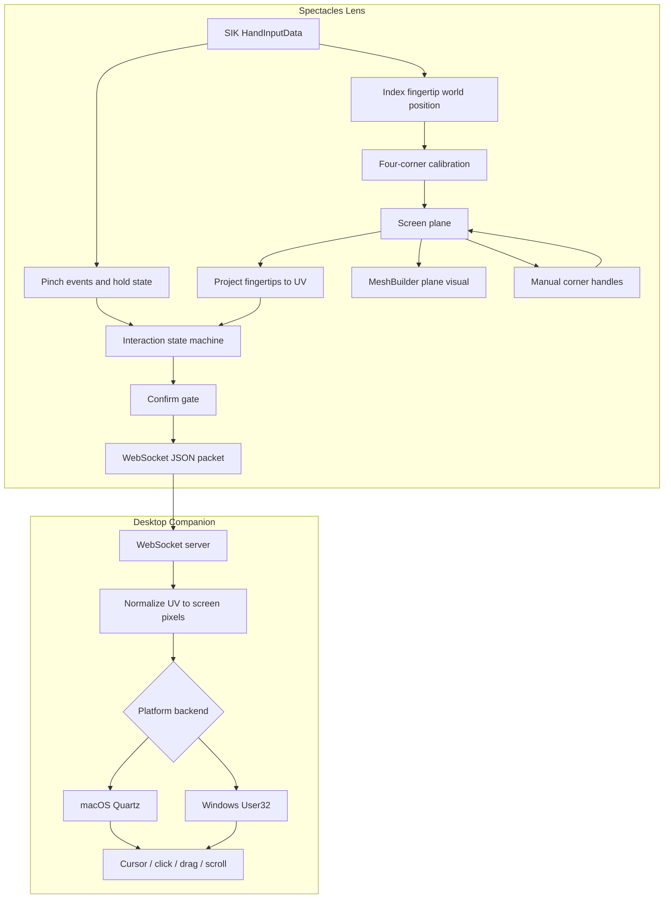

# Architecture

AirTouch has two runtime pieces:

1. A Lens Studio Spectacles Lens.
2. A desktop companion process.



## Lens Components

`AirTouchController.ts`

- owns lifecycle
- reads hand tracking
- coordinates calibration and streaming
- turns calibrated plane collision into touch down/up when plane touch mode is enabled
- detects index/middle two-finger scroll
- builds and updates the calibration plane visual with `MeshBuilder`
- places optional manual corner handles when `cornerHandlePrefab` is assigned
- exposes public confirm/recalibrate methods for Lens Studio callbacks
- provides Lens Studio editor simulation

`ScreenProjection.ts`

- stores the calibrated screen plane
- fits an orthogonal plane frame from all four sampled edges
- projects 3D fingertip positions into that frame
- maps the projected point through the four-corner bilinear UV solver

`ScreenProjectionMath.ts`

- contains the runtime-independent quadrilateral validation and bilinear inverse solver
- makes all four calibration points map to their exact normalized corners

`InteractionStateMachine.ts`

- converts inside/out-of-bounds and pinch transitions into pointer phases
- leaves two-finger scroll as a higher-level gesture emitted by `AirTouchController.ts`

`NetworkSender.ts`

- opens a WebSocket through `InternetModule`
- sends JSON packets
- receives command packets such as `recalibrate`

## Desktop Components

`server.py`

- dependency-free WebSocket server
- accepts Lens packets
- owns fake-hand simulation
- broadcasts recalibration commands

`mouse_controller.py`

- maps normalized `u/v` to screen pixels
- dispatches platform mouse and scroll events
- applies adaptive pixel smoothing and tap anchoring for small targets

`fake_client.py`

- sends test packets to the server over WebSocket

## Transport Notes

The MVP uses WebSocket over local Wi-Fi because it is simple to test from Lens Studio and Spectacles.

Lens Studio's local type definitions expose Bluetooth GATT APIs through `Bluetooth.BluetoothCentralModule`, so BLE support is present at the Lens API level. AirTouch does not currently use BLE. A BLE transport would need:

- a desktop BLE GATT peripheral/server
- a Lens BLE client module
- compact binary pointer packets
- reconnect and MTU handling

BLE may be useful for experiments, but WebSocket is still the recommended low-friction transport for the current cursor MVP.

## Coordinate System

Lens packets use normalized display coordinates:

```txt
u = 0 left, 1 right
v = 0 top, 1 bottom
```

The desktop companion maps them to:

```txt
x = u * (screenWidth - 1)
y = v * (screenHeight - 1)
```

## Calibration Flow

```txt
pinch four corners
build screen plane
show MeshBuilder plane visual
place optional corner handles
wait for confirm button callback
stream pointer packets
```

The confirm gate keeps the desktop cursor idle while the user fine-tunes the plane. Calling the controller's public `confirmAirTouch` method enables packet streaming.

## Four-Corner Projection

AirTouch does not assume the sampled screen is a perfect rectangle. It projects all four corner samples into a stable local plane, treats them as a quadrilateral, and numerically inverts the bilinear surface for every fingertip sample.

```txt
top left     -> u=0, v=0
top right    -> u=1, v=0
bottom left  -> u=0, v=1
bottom right -> u=1, v=1
```

This removes the previous bottom-right drift caused by deriving UV only from the top and left edges. Concave, crossed, or degenerate corner samples are rejected and calibration restarts.
