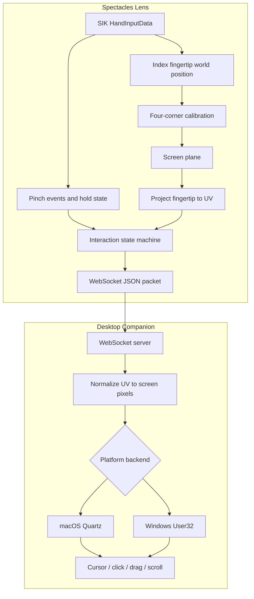

# Architecture

AirTouch has two runtime pieces:

1. A Lens Studio Spectacles Lens.
2. A desktop companion process.



## Lens Components

`AirTouchController.ts`

- owns lifecycle
- reads hand tracking
- coordinates calibration and streaming
- provides Lens Studio editor simulation

`ScreenProjection.ts`

- stores the calibrated screen plane
- projects 3D fingertip positions into normalized `u/v`

`InteractionStateMachine.ts`

- converts inside/out-of-bounds and pinch transitions into pointer phases
- leaves scroll as a higher-level gesture emitted by `AirTouchController.ts`

`NetworkSender.ts`

- opens a WebSocket through `InternetModule`
- sends JSON packets
- receives command packets such as `recalibrate`

## Desktop Components

`server.py`

- dependency-free WebSocket server
- accepts Lens packets
- owns fake-hand simulation
- broadcasts recalibration commands

`mouse_controller.py`

- maps normalized `u/v` to screen pixels
- dispatches platform mouse and scroll events

`fake_client.py`

- sends test packets to the server over WebSocket

## Coordinate System

Lens packets use normalized display coordinates:

```txt
u = 0 left, 1 right
v = 0 top, 1 bottom
```

The desktop companion maps them to:

```txt
x = u * (screenWidth - 1)
y = v * (screenHeight - 1)
```
